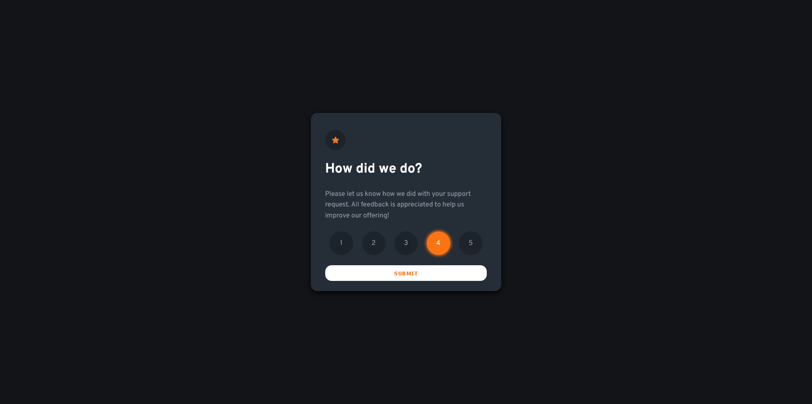

# Frontend Mentor - Interactive rating component solution

This is a solution to the [Interactive rating component challenge on Frontend Mentor](https://www.frontendmentor.io/challenges/interactive-rating-component-koxpeBUmI). Frontend Mentor challenges help you improve your coding skills by building realistic projects.

## Table of contents

- [Overview](#overview)
  - [The challenge](#the-challenge)
  - [Screenshot](#screenshot)
  - [Links](#links)
  - [Built with](#built-with)
  - [What I learned](#what-i-learned)
  - [Continued development](#continued-development)
- [Author](#author)

## Overview

### The challenge

Users should be able to:

- View the optimal layout for the app depending on their device's screen size
- See hover states for all interactive elements on the page
- Select and submit a number rating
- See the "Thank you" card state after submitting a rating

### Screenshot



### Links

- Solution URL: [https://github.com/spaziutempu/interactive-rating-component](https://github.com/spaziutempu/interactive-rating-component)
- Live Site URL: [https://darling-horse-fa5904.netlify.app](https://darling-horse-fa5904.netlify.app)

## My process

### Built with

- Semantic HTML5 markup
- CSS custom properties
- Flexbox
- Mobile-first workflow
- Vanilla JS

### What I learned

- to use a form with radio buttons to catch and display the value chosen

- to combine multiple pseudo-class

```css
button:disabled:hover {
  ...;
}
```

### Continued development

- improve ui colors and borders

- dry css

- export the form result in localStorage for exemple

## Author

- Website - [github](https://github.com/spaziutempu)
- Frontend Mentor - [spaziu](https://www.frontendmentor.io/profile/spaziutempu)
